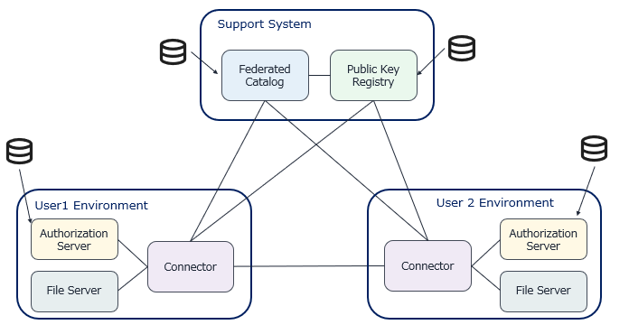

# MinimumViableDataspace



## 動作確認方法
- Public Key Registry の起動 (ポート番号: 7450)
  
```bash
cd support-system/public-key-registy && docker compose up -d
```
- Federated Catalog の起動 (ポート番号: 7451)
```bash
cd support-system/federated-catalog && docker compose up -d 
```

- コネクタの起動 (ポート番号: 7550)
```bash
cd user-env/connector && docker compose up -d 
```
- 認可サーバの起動 (ポート番号: 7551)
```bash
cd user-env/authz && docker compose up -d 
```
- HTTPファイルサーバの起動 (ポート番号: 7552)
```bash
cd user-env/file-server && docker compose up -d
```

- データ共有の一連の手続きは、コネクタの app ディレクトリにある test.py, test2.py スクリプトを実行することで確かめられる。
```bash
cd user-env/connector/app
python3 test.py # HTPP File Serverで提供されているデータを取得する
python3 test2.py # DUCRBのAPIを呼ぶ
```
