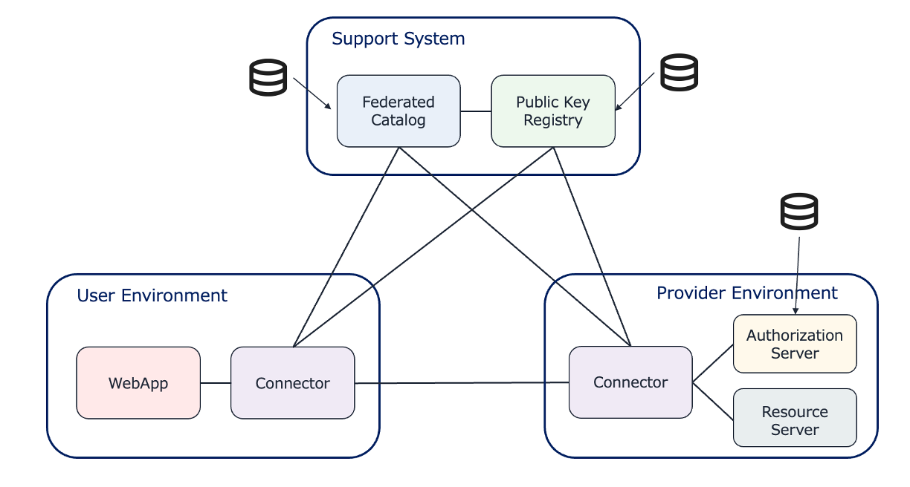

# MinimumViableDataspace



## 動作確認方法

### ユーザ環境のコンポーネント起動

- Public Key Registry の起動 (ポート番号: 7450)
  
```bash
cd support-system/public-key-registy && docker compose up -d
```
- Federated Catalog の起動 (ポート番号: 7451)
```bash
cd support-system/federated-catalog && docker compose up -d 
```

### ユーザ環境のコンポーネント起動

- コネクタの起動 (ポート番号: 7550)
```bash
cd user-env/connector && docker compose up -d 
```
- 認可サーバの起動 (ポート番号: 7551)
```bash
cd user-env/authz && docker compose up -d 
```
- HTTPファイルサーバの起動 (ポート番号: 7552)
```bash
cd user-env/file-server && docker compose up -d
```

### ウェブアプリケーションのコンポーネント起動

- FC / PKR Viewer の起動 (ポート番号: 7650)
```bash
cd webapps/fc-pkr-viewer && docker compose up -d
```

- Connector Console の起動 (ポート番号: 7651)
```bash
cd webapps/connector-console && docker compose up -d
```
